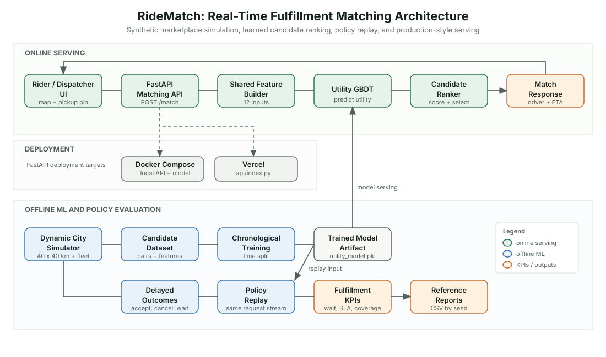
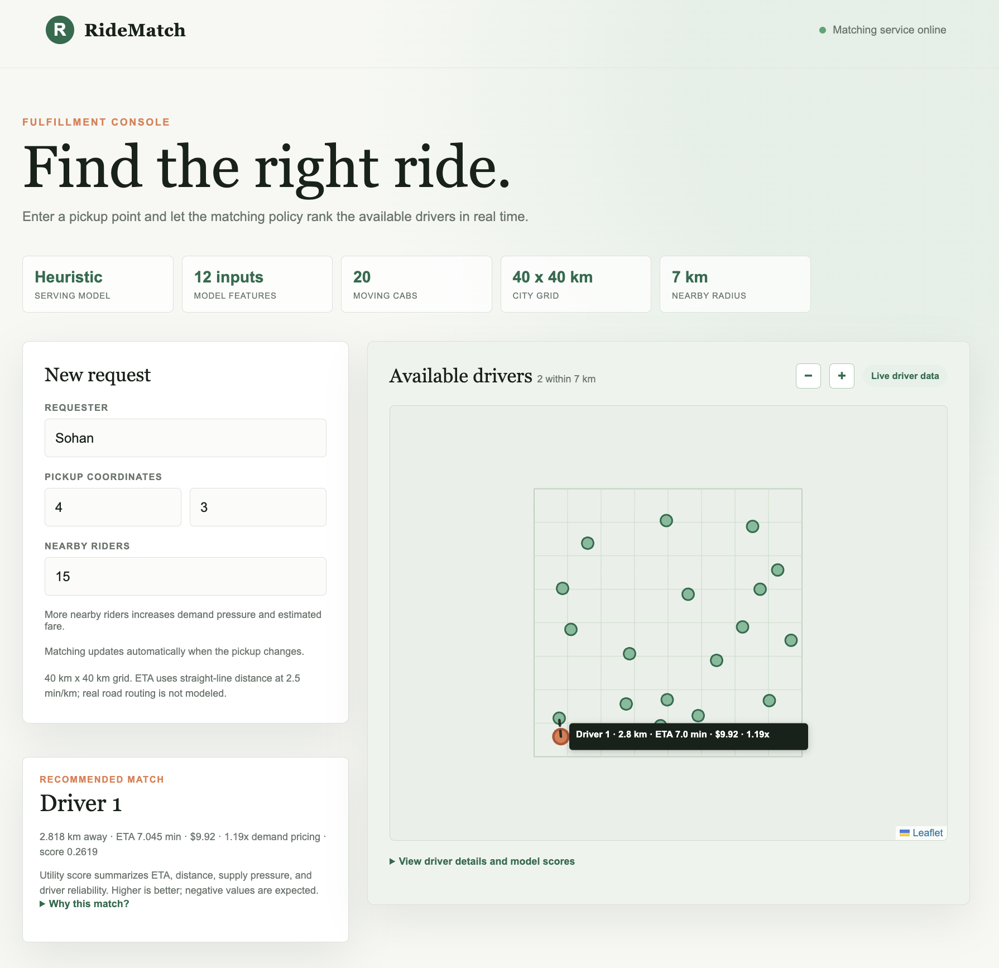

# RideMatch: Real-Time Driver-Rider Matching Simulator

RideMatch is a small, portfolio-friendly marketplace ML project that simulates a city with riders and drivers and trains a model to score whether a given driver-rider pair is a good match.

## Goal

This project demonstrates a clean end-to-end ML workflow for a ride-sharing fulfillment setting:

- synthetic data generation for driver and rider events
- feature engineering for candidate matches
- model training and evaluation against a heuristic baseline
- an API for serving match decisions
- Dockerized deployment for production-style shipping

## Architecture



The same feature builder is used during training, policy replay, and API
serving. The simulator supplies request-time state and delayed outcomes; the
policy evaluator replays the nearest-driver baseline and learned policy on the
same seeded request stream before computing KPIs.

For the full model card, score definitions, metric interactions, explainability
surfaces, and reproduction commands, see [Models and Metrics](models/README.md).

## UI Preview

The deployed console presents the fulfillment workflow: request inputs on the
left, a moving driver pool and route estimate on the map, and the recommended
match with model context below the request.

Try the deployed app: [RideMatch Dispatch](https://ride-match-ml.vercel.app/)



## Data strategy

RideMatch starts with a self-contained simulator rather than a public trip
dataset. Public mobility datasets generally contain completed trips, but not
the time-varying driver state, open requests, rejected candidates, or matching
counterfactuals needed to study fulfillment decisions.

The simulator is therefore the primary source of truth for the MVP. It gives
us control over driver and rider movement, demand and supply imbalance, rush
hours, driver shortages, request cancellations, and ground-truth outcomes.
Those controls make it possible to test matching policies against the KPIs the
project is designed to demonstrate: wait time, utilization, match coverage,
and SLA hit rate.

Real mobility data is deliberately deferred. After the simulator and offline
evaluation are stable, an optional transferability notebook may reuse the
feature and evaluation interfaces on a public trip dataset. That add-on would
validate broad mobility intuitions such as distance and time-of-day effects;
it would not replace the simulator or claim to reproduce Lyft's internal
fulfillment data.

## Tech stack

- Python
- pandas / numpy
- scikit-learn
- FastAPI
- Docker

## Quick start

```bash
cd ride-match-ml
python -m venv .venv
source .venv/bin/activate
pip install -r requirements.txt
python -m pytest
python src/simulator/generate_data.py --drivers 40 --riders 600 --steps 1440 --output data/processed/synthetic_matches.csv
python src/models/train_model.py --input data/processed/synthetic_matches.csv --output models/model.pkl
python src/models/train_utility_model.py --input data/processed/synthetic_matches.csv --output models/utility_model.pkl
python src/models/evaluate.py --model models/model.pkl --input data/processed/synthetic_matches.csv
python -m src.models.policy_eval --model models/utility_model.pkl --drivers 40 --riders 600 --steps 1440 --seed 42
python -m src.models.create_reference_reports --model models/utility_model.pkl --output-dir reports
uvicorn src.service.main:app --reload
```

Open https://ride-match-ml.vercel.app/ for the interactive dispatch console.
Pickup changes and moving driver positions automatically refresh the ranked
match, ETA, fare estimate, route label, and driver table. The demo uses a
20-driver fleet in a 40 km city grid; the simulator's reproducible training and
replay defaults use 40 drivers. Fare is a capped pre-ride estimate based on
distance, ETA, and nearby rider demand relative to available drivers. It is
separate from utility ranking and is not post-ride billing.
FastAPI documentation is available at https://ride-match-ml.vercel.app/docs.

## Vercel deployment

The FastAPI application is exported through `api/index.py`, which re-exports
the ASGI instance from `src/service/main.py`. Deploy from the repository root
with the Vercel CLI:

```bash
npm install -g vercel
vercel login
vercel link
vercel deploy --prod
```

The deployed endpoints are:

```text
https://your-project.vercel.app/
https://your-project.vercel.app/health
https://your-project.vercel.app/docs
```

Model binaries and generated CSVs are not part of the Git repository. A CLI
deployment may include an existing artifact in its upload, but Git-based
Vercel deployments should assume no model is available and use the safe
heuristic fallback unless the model is provided through separate storage or an
approved artifact workflow. Docker Compose mounts
`models/utility_model.pkl` explicitly.

Generated CSVs under `data/processed/` and model artifacts under `models/` are
ignored by Git. Commit the code, configuration, tests, and notebooks; recreate
the data and model from the commands above or from Colab.

The small CSVs under `reports/` are committed reference summaries. Regenerate
them with `python -m src.models.create_reference_reports` after rebuilding the
ignored model artifact.

## Colab workflow

Use [notebooks/exploration.ipynb](notebooks/exploration.ipynb) as the experiment
starting point. The notebook is intentionally a research surface: use it for
data inspection, feature experiments, model comparisons, plots, and recorded
results. Move any experiment that survives evaluation into `src/` so the API
and command-line workflow stay reproducible.

Once this repository is pushed to GitHub, open the notebook directly in Colab:

[Open RideMatch experiments in Google Colab](https://colab.research.google.com/github/sohan2000/ride-match-ml/blob/main/notebooks/exploration.ipynb)

In Colab:

```python
!git clone https://github.com/sohan2000/ride-match-ml.git
%cd ride-match-ml
!pip install -r requirements.txt
```

Then generate a larger experiment dataset:

```python
from src.simulator.generate_data import generate_dataset

candidates = generate_dataset(
    num_drivers=100,
    num_riders=10_000,
    steps=1_440,
    seed=42,
)
candidates.to_csv("data/processed/colab_candidates.csv", index=False)
```

## Evaluation snapshot

Policy replay compares nearest-driver and Utility GBDT decisions on the same
seeded request stream. The current three-seed reference run shows nearest-driver
ahead of the learned policy, so the utility model is documented as an experiment
rather than a claimed production improvement.

Reference outcome-aware replay across three seeds (`600` requests, `40` drivers,
`1,440` minutes per seed):

| Metric | Nearest | Utility GBDT |
| --- | ---: | ---: |
| Coverage | 85.89% | 84.89% |
| Average wait | 6.103 min | 6.270 min |
| P90 wait | 10.000 min | 10.203 min |
| SLA hit rate | 47.28% | 44.94% |
| Cancellation rate | 14.11% | 15.11% |
| Driver rejection rate | 9.06% | 8.00% |
| Rider cancellation rate | 5.06% | 6.89% |
| Utilization | 0.1901 | 0.1860 |

These are synthetic reference results, not claims about real Lyft traffic. The
current utility policy is not better than nearest-driver under this replay:
it has higher wait and cancellation rates and lower coverage, SLA attainment,
and utilization. The result is still useful because it identifies the next
modeling problem honestly: the utility target and online features do not yet
predict acceptance and cancellation well enough to improve policy outcomes.

The detailed metric definitions, score interactions, explainability workflow,
and limitations live in [Models and Metrics](models/README.md).

With the API running, send a request and its currently available drivers:

```bash
curl -X POST https://ride-match-ml.vercel.app/match \
   -H 'Content-Type: application/json' \
   -d '{"request_id":"req-demo","pickup_x":4.0,"pickup_y":3.0,"drivers":[{"driver_id":"d1","x":2.0,"y":3.0,"idle_seconds":120},{"driver_id":"d2","x":8.0,"y":3.0,"idle_seconds":60}]}'
```

The response includes the selected driver, its utility score, pre-ride fare,
demand multiplier, and every candidate's distance, ETA, and score. The service
loads `models/utility_model.pkl` by default. Before a model artifact exists, it
uses the nearest-driver heuristic and labels the response
`heuristic_fallback`. The API accepts 1–100 drivers and 1–100 open requests.

Compose serves `models/utility_model.pkl` by default. Set
`RIDEMATCH_MODEL_PATH=/app/models/model.pkl` when you want to compare the
classifier artifact instead.

## MVP data contract

The simulator uses four records. Their executable definitions live in
`src/simulator/schema.py`; timestamps are timezone-aware ISO-8601 values and
coordinates are grid kilometers.

### `RideRequestEvent`

One rider request entering the marketplace:

| Field                    | Type     | Meaning                                           |
| ------------------------ | -------- | ------------------------------------------------- |
| `event_time`             | datetime | Request creation time                             |
| `request_id`, `rider_id` | string   | Request and rider identifiers                     |
| `pickup_x`, `pickup_y`   | float    | Pickup location                                   |
| `dropoff_x`, `dropoff_y` | float    | Dropoff location                                  |
| `status`                 | enum     | `waiting`, `matched`, `cancelled`, or `completed` |

### `DriverSnapshot`

The driver state available to the matcher at the request timestamp:

| Field          | Type     | Meaning                                     |
| -------------- | -------- | ------------------------------------------- |
| `event_time`   | datetime | Snapshot time, matching the request context |
| `driver_id`    | string   | Driver identifier                           |
| `x`, `y`       | float    | Current driver location                     |
| `status`       | enum     | `available`, `assigned`, or `offline`       |
| `idle_seconds` | integer  | Time available before this snapshot         |

### `CandidateMatchRecord`

One eligible driver-request pair. This is the training table and contains only
information known at matching time plus delayed labels:

`event_time`, `request_id`, `driver_id`, `distance_km`, `eta_minutes`,
`driver_idle_minutes`, `available_drivers`, `open_requests`, `hour_of_day`,
`matched`, `realized_wait_minutes`, `cancelled`, `candidate_utility`,
`driver_acceptance_rate`, `same_pickup_zone`, `pickup_zone_supply`, and
`pickup_zone_demand_supply_ratio`.

The repository contains two scikit-learn GBDT artifacts. The classifier is a
`GradientBoostingClassifier` that predicts `matched` probability, while the
serving default is a `GradientBoostingRegressor` trained on `candidate_utility`.
Candidate selection uses the highest score from the loaded artifact, with
nearest-driver selection as the baseline. Both artifacts use the same
12-column online feature vector:
`distance_km`, `eta_minutes`, `driver_idle_minutes`, `available_drivers`,
`open_requests`, `demand_supply_ratio`, `hour_of_day`, `is_peak`, and the
historical `driver_acceptance_rate` available before the request. The rate is
updated only after an assignment attempt; the simulator does not leak the
current request's outcome into its feature row.
The vector also includes pickup-zone context: whether the driver is already in
the pickup zone, available supply in that zone, and pickup-zone demand-to-supply
ratio. Zones are fixed 5 km by 5 km cells in the 40 km by 40 km city.
`realized_wait_minutes` and `cancelled` are evaluation labels and must not be
used as online features.

The API additionally returns a pre-ride fare estimate. Its base is `$3.00`,
plus `$1.45 * distance_km` and `$0.18 * eta_minutes`, multiplied by a capped
surge of `min(2.5, 1 + 0.25 * open_requests / available_drivers)`. This is a
transparent marketplace signal for the demo, separate from utility ranking.

`candidate_utility` is a delayed, policy-independent synthetic target for the
next experiment. The current simulator defines it as:

`-eta_minutes - 0.25 * ride_minutes + 0.05 * driver_idle_minutes - 12.0 * cancellation_risk + 2.0 * acceptance_probability + 3.0 * historical_acceptance - 12.0 * rider_cancellation_probability - 0.5 * demand_pressure - peak_friction + 1.5 * same_pickup_zone - 0.25 * pickup_zone_demand_supply_ratio`.

The cancellation terms penalize long-ETA and rider-cancellation risk, while
idle time and historical driver acceptance add fairness and reliability
signals. Supply pressure and peak-hour friction provide market context. These
weights are experiment parameters, not facts
about real riders or drivers. Train it with
`src/models/train_utility_model.py` and rank by predicted utility; compare that
policy with the classifier and nearest-driver baseline rather than assuming it
is better.

### `AssignmentOutcome`

The delayed result of the selected assignment:

`request_id`, nullable `driver_id`, `status`, `wait_minutes`, nullable
`ride_minutes`, and `cancelled`.

Out of scope for the MVP: surge pricing optimization, pooled rides,
geospatial road-network routing, online learning, and a real external data
source. These can be follow-up experiments after the simulator produces a
stable baseline report.
